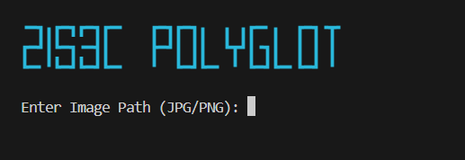

# Polyglot File Generator

[](https://www.python.org/downloads/)
[](LICENSE)
[]()


A visual, interactive **Security Research Tool** designed to demonstrate data hiding by creating files that are valid in multiple formats simultaneously (e.g., JPEG + PDF). Built for security researchers, CTF players, and curious developers.

<p align="center">
  
</p>

## ✨ Features

- **Multi-Format Support**:
  - **Image + PDF**: Creates a file that opens as an Image (JPG/PNG) but contains a hidden PDF.
  - **Structure Injection**: Injects PDF headers into private chunks (PNG) or comment segments (JPG).
- **Steganography Suite**:
  - **Concealment**: Hide entire documents inside innocent-looking images.
  - **Bypass**: Can potentially bypass file upload filters that only check extensions or magic bytes.
- **🛡️ Educational Mode**:
  - **Visualization**: See exactly where the data is injected.
  - **Validation**: Ensures both formats remain valid.
- **🚀 Interactive details**:
  - **Wizard Mode**: Step-by-step interactive CLI.
  - **Smart Naming**: Auto-generates output filenames.

---

## 🛠️ Tech Stack

*   **Core**: [Python 3.8+](https://www.python.org/)
*   **UI/CLI**: [Rich](https://github.com/Textualize/rich) (for beautiful terminal output)
*   **Standard Lib**: `struct`, `zlib`, `argparse`

---

## 🚀 Getting Started

### Prerequisites

1.  **Python 3.8+**

### 📥 Installation

1.  **Clone the repository**
    ```bash
    git clone https://github.com/zis3c/Polyglot-File.git
    cd Polyglot-File
    ```

2.  **Install Dependencies**
    ```bash
    pip install -r requirements.txt
    ```

### ▶️ Usage

#### Interactive Mode (Recommended)
Simply run the script to start the wizard:
```bash
python polyglot_tool.py
```

#### Command Line
```bash
python polyglot_tool.py --image input.jpg --pdf hidden.pdf --output result.jpg
```

---

## 🐛 Troubleshooting

*   **"Unsupported Image" error?**
    *   Ensure you are using standard JPG or PNG files.
*   **File not opening?**
    *   Some PDF viewers are stricter than others. Try opening the result in Chrome or Adobe Reader.

---

## 🤝 Contributing

Contributions are welcome! Please feel free to submit a Pull Request.

1.  Fork the project
2.  Create your feature branch (`git checkout -b feature/AmazingFeature`)
3.  Commit your changes (`git commit -m 'Add some AmazingFeature'`)
4.  Push to the branch (`git push origin feature/AmazingFeature`)
5.  Open a Pull Request

---

## 📄 License

This project is licensed under the MIT License - see the [LICENSE](LICENSE) file for details.

---

<center>Built with ❤️ by <b>@zis3c</b></center>
