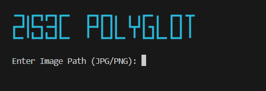

# Polyglot File Generator


<p align="center">
  
</p>

📺 **Video Tutorial:** [**Watch how to use the repo here**](https://youtu.be/5oVx4ZH_fLc)

An educational tool for creating **polyglot files** — files that are simultaneously valid in multiple formats (e.g., JPEG + PDF, PNG + PDF). Built with Python for steganography research and file structure exploration.

> [!WARNING]
> **Educational Purposes Only**: This tool is designed for educational purposes and security research. The authors are not responsible for any misuse.

## Features

- 🖼️ **Multi-Format Support**: Generate valid `JPG+PDF` and `PNG+PDF` polyglot files.
- 🎨 **Premium UI**: Beautiful ASCII art banner and color-coded output via `rich`.
- 🖱️ **Interactive Mode**: Easy-to-use wizard for drag-and-drop file selection.
- 🛡️ **Auto-Injection**: Handles complex chunk injection and comment segmentation automatically.
- 🧠 **Smart Validation**: Strips quotes from drag-and-drop paths and verifies file headers.
- 📄 **Organized Output**: Saves results to a dedicated directory with smart naming.

## Installation

1. **Clone the repository**
   ```bash
   git clone https://github.com/zis3c/Polyglot-File.git
   cd Polyglot-File
   ```

2. **Install dependencies**
   ```bash
   pip install -r requirements.txt
   ```

## Project Structure

```
Polyglot-File/
├── polyglot_tool.py        # Main script to create polyglot files
├── requirements.txt        # Python dependencies
├── CONTRIBUTING.md         # Contribution guidelines
├── LICENSE                 # MIT License file
├── README.md               # Project documentation
├── polyglot.png            # UI preview image
├── input_files/            # Place your source image and PDF files here
└── polyglot_results/       # Generated polyglot files are saved here
```

## Usage

### Interactive Mode
Simply run the script without arguments:
```bash
python polyglot_tool.py
```
Follow the prompts to drag-and-drop your image and PDF files. The tool handles the rest automatically.

### Command Line Interface
To see all available options:
```bash
python polyglot_tool.py --help
```

**Example:**
```bash
python polyglot_tool.py --image "input.jpg" --pdf "hidden.pdf" --output result.jpg
```

| Argument | Description | Required |
|----------|-------------|----------|
| `--image` | Path to the source JPEG or PNG image | Yes |
| `--pdf` | Path to the source PDF document | Yes |
| `--output` | Desired output filename | No |
| `--help` | Show the help message and exit | — |

## How It Works

1. **Parsing**: Validates the input image structure — PNG chunks or JPEG markers.
2. **Injection**:
   - **PNG**: Injects a custom `pDfH` chunk containing the PDF header and stream start.
   - **JPG**: Embeds the PDF header inside a crafted `COM` (comment) segment.
3. **Appending**: Appends the full PDF body after the image data, wrapped in a PDF stream.
4. **Result**: The output file is simultaneously a valid image (opened by image viewers) and a valid PDF (parsed from the injected header).

## Contributing

Contributions are welcome! Please see [CONTRIBUTING.md](CONTRIBUTING.md) for guidelines on reporting bugs, suggesting enhancements, and submitting pull requests.

## License

This project is licensed under the MIT License — see the [LICENSE](LICENSE) file for details.
